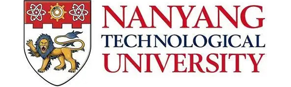
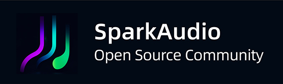
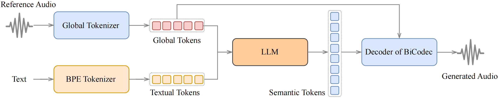

<div align="center">
    <h1>
    SparkTTS-Local (Windows)
    </h1>
    <p>
    <b>🪟 Windows-optimized setup for SparkTTS with CUDA acceleration</b><br>
    <em>Spark-TTS: An Efficient LLM-Based Text-to-Speech Model with Single-Stream Decoupled Speech Tokens</em>
    </p>
    <p>
    
    </p>
        <p>
        
        
        
    </p>
    <p>
        
        
        
    </p>
    <p>
    </p>
    <a href="https://arxiv.org/pdf/2503.01710"></a>
    <a href="https://sparkaudio.github.io/spark-tts/"></a>
    <a href="https://huggingface.co/SparkAudio/Spark-TTS-0.5B"></a>
    <a href="https://github.com/SparkAudio/Spark-TTS"></a>
    <a href="https://github.com/SparkAudio/Spark-TTS"></a>
    <a href="https://github.com/SparkAudio/Spark-TTS"></a>
    <a href="https://github.com/SparkAudio/Spark-TTS"></a>
</div>


## SparkTTS-Local 🔥

> **⚠️ This is a Windows-focused fork optimized for local installation and ease of use.**  
> **🚀 CUDA/GPU acceleration is strongly recommended for acceptable performance.**

### Overview

SparkTTS-Local provides a streamlined Windows setup for the advanced SparkTTS text-to-speech system. This repository includes batch files, comprehensive installation guides, and Windows-specific optimizations for running SparkTTS with CUDA acceleration.

### Key Features

- **Simplicity and Efficiency**: Built entirely on Qwen2.5, Spark-TTS eliminates the need for additional generation models like flow matching. Instead of relying on separate models to generate acoustic features, it directly reconstructs audio from the code predicted by the LLM. This approach streamlines the process, improving efficiency and reducing complexity.
- **High-Quality Voice Cloning**: Supports zero-shot voice cloning, which means it can replicate a speaker's voice even without specific training data for that voice. This is ideal for cross-lingual and code-switching scenarios, allowing for seamless transitions between languages and voices without requiring separate training for each one.
- **Bilingual Support**: Supports both Chinese and English, and is capable of zero-shot voice cloning for cross-lingual and code-switching scenarios, enabling the model to synthesize speech in multiple languages with high naturalness and accuracy.
- **Controllable Speech Generation**: Supports creating virtual speakers by adjusting parameters such as gender, pitch, and speaking rate.

---

<table align="center">
  <tr>
    <td align="center"><b>Inference Overview of Voice Cloning</b><br></td>
  </tr>
  <tr>
    <td align="center"><b>Inference Overview of Controlled Generation</b><br></td>
  </tr>
</table>


## 🚀 News

- **[2025-03-04]** Our paper on this project has been published! You can read it here: [Spark-TTS](https://arxiv.org/pdf/2503.01710). 

- **[2025-03-12]** Nvidia Triton Inference Serving is now supported. See the Runtime section below for more details.


## Install

### 🛠️ Requirements

- **Windows 10/11**
- **Python 3.10 or 3.11** (recommended for best CUDA compatibility)
- **Git**
- **NVIDIA GPU with CUDA support** (strongly recommended)
- **CUDA drivers** installed on your system

> **⚠️ Performance Note:** While CPU-only mode is possible, it will be significantly slower. GPU acceleration via CUDA is highly recommended for practical use.

### 🚀 Windows Installation

#### 1. **Install Python**

- Download Python 3.11.x from [python.org](https://www.python.org/downloads/release/python-3116/)
- During install, **check "Add Python to PATH"**

#### 2. **Clone the Repository**

```sh
git clone https://github.com/SparkAudio/Spark-TTS.git
cd Spark-TTS
```

#### 3. **Create and Activate Virtual Environment**

```sh
python -m venv venv
venv\Scripts\activate
```

#### 4. **Upgrade pip**

```sh
pip install --upgrade pip
```

#### 5. **Install PyTorch with CUDA Support**

**CUDA 12.1 (Recommended):**

```sh
pip install torch torchvision torchaudio --index-url https://download.pytorch.org/whl/cu121
```

**CUDA 11.8 (Alternative):**

```sh
pip install torch torchvision torchaudio --index-url https://download.pytorch.org/whl/cu118
```

> **⚠️ CPU-Only Installation:** If you don't have an NVIDIA GPU, you can install CPU-only PyTorch with `pip install torch torchvision torchaudio`, but performance will be significantly slower.

#### 6. **Install Dependencies**

```sh
pip install -r requirements.txt
```

### 🐧 Linux/Mac Users

> **📝 Note:** This repository is optimized for Windows. For Linux/Mac installation, please refer to the [original SparkTTS repository](https://github.com/SparkAudio/Spark-TTS) which provides comprehensive Linux installation instructions.

### 📦 **Model Download**

#### Method 1: Using the provided script (Recommended)

```sh
python download_model.py
```

#### Method 2: Manual download via python:
```python
from huggingface_hub import snapshot_download

snapshot_download("SparkAudio/Spark-TTS-0.5B", local_dir="pretrained_models/Spark-TTS-0.5B")
```

#### Method 3: Download via git clone:
```sh
mkdir -p pretrained_models

# Make sure you have git-lfs installed (https://git-lfs.com)
git lfs install

git clone https://huggingface.co/SparkAudio/Spark-TTS-0.5B pretrained_models/Spark-TTS-0.5B
```

### 🎯 **Basic Usage**

#### Quick Start for Windows:
Run the web interface using the provided batch file:
```sh
webui.bat
```

Or manually:
```sh
python webui.py --device 0
```

> **💡 Tip:** The batch file automatically activates the virtual environment if needed.

#### Command Line Inference (All Platforms):
For direct command line inference without the web interface:

``` sh
python -m cli.inference \
    --text "text to synthesis." \
    --device 0 \
    --save_dir "path/to/save/audio" \
    --model_dir pretrained_models/Spark-TTS-0.5B \
    --prompt_text "transcript of the prompt audio" \
    --prompt_speech_path "path/to/prompt_audio"
```

### 🌐 **Web UI Usage**

The web interface allows you to perform Voice Cloning and Voice Creation. Voice Cloning supports uploading reference audio or directly recording the audio.

**Starting the Web UI:**
- Windows: Run `webui.bat` or `python webui.py --device 0`
- Linux/Mac: Run `python webui.py --device 0`

**Access:** The web interface will be available at [http://0.0.0.0:7860](http://0.0.0.0:7860)

**Important:** For voice cloning, you must upload or record an audio file as reference. The system will return an error if no audio file is provided.


| **Voice Cloning** | **Voice Creation** |
|:-------------------:|:-------------------:|
|  |  |


**Optional Methods**

For additional CLI and Web UI methods, including alternative implementations and extended functionalities, you can refer to:

- [CLI and UI by AcTePuKc](https://github.com/SparkAudio/Spark-TTS/issues/10)


## Runtime

**Nvidia Triton Inference Serving**

We now provide a reference for deploying Spark-TTS with Nvidia Triton and TensorRT-LLM. The table below presents benchmark results on a single L20 GPU, using 26 different prompt_audio/target_text pairs (totalling 169 seconds of audio):

| Model | Note   | Concurrency | Avg Latency     | RTF | 
|-------|-----------|-----------------------|---------|--|
| Spark-TTS-0.5B | [Code Commit](https://github.com/SparkAudio/Spark-TTS/tree/4d769ff782a868524f29e0be851ca64f8b22ebf1/runtime/triton_trtllm) | 1                   | 876.24 ms | 0.1362|
| Spark-TTS-0.5B | [Code Commit](https://github.com/SparkAudio/Spark-TTS/tree/4d769ff782a868524f29e0be851ca64f8b22ebf1/runtime/triton_trtllm) | 2                   | 920.97 ms | 0.0737|
| Spark-TTS-0.5B | [Code Commit](https://github.com/SparkAudio/Spark-TTS/tree/4d769ff782a868524f29e0be851ca64f8b22ebf1/runtime/triton_trtllm) | 4                   | 1611.51 ms | 0.0704|


Please see the detailed instructions in [runtime/triton_trtllm/README.md](runtime/triton_trtllm/README.md ) for more information.


## **Demos**

Here are some demos generated by Spark-TTS using zero-shot voice cloning. For more demos, visit our [demo page](https://sparkaudio.github.io/spark-tts/).

---

<table>
<tr>
<td align="center">
    
**Donald Trump**
</td>
<td align="center">
    
**Zhongli (Genshin Impact)**
</td>
</tr>

<tr>
<td align="center">

[Donald Trump](https://github.com/user-attachments/assets/fb225780-d9fe-44b2-9b2e-54390cb3d8fd)

</td>
<td align="center">
    
[Zhongli](https://github.com/user-attachments/assets/80eeb9c7-0443-4758-a1ce-55ac59e64bd6)

</td>
</tr>
</table>

---

<table>

<tr>
<td align="center">
    
**陈鲁豫 Chen Luyu**
</td>
<td align="center">
    
**杨澜 Yang Lan**
</td>
</tr>

<tr>
<td align="center">
    
[陈鲁豫Chen_Luyu.webm](https://github.com/user-attachments/assets/5c6585ae-830d-47b1-992d-ee3691f48cf4)
</td>
<td align="center">
    
[Yang_Lan.webm](https://github.com/user-attachments/assets/2fb3d00c-abc3-410e-932f-46ba204fb1d7)
</td>
</tr>
</table>

---


<table>
<tr>
<td align="center">
    
**余承东 Richard Yu**
</td>
<td align="center">
    
**马云 Jack Ma**
</td>
</tr>

<tr>
<td align="center">

[Yu_Chengdong.webm](https://github.com/user-attachments/assets/78feca02-84bb-4d3a-a770-0cfd02f1a8da)

</td>
<td align="center">
    
[Ma_Yun.webm](https://github.com/user-attachments/assets/2d54e2eb-cec4-4c2f-8c84-8fe587da321b)

</td>
</tr>
</table>

---


<table>
<tr>
<td align="center">
    
**刘德华 Andy Lau**
</td>
<td align="center">

**徐志胜 Xu Zhisheng**
</td>
</tr>

<tr>
<td align="center">

[Liu_Dehua.webm](https://github.com/user-attachments/assets/195b5e97-1fee-4955-b954-6d10fa04f1d7)

</td>
<td align="center">
    
[Xu_Zhisheng.webm](https://github.com/user-attachments/assets/dd812af9-76bd-4e26-9988-9cdb9ccbb87b)

</td>
</tr>
</table>


---

<table>
<tr>
<td align="center">
    
**哪吒 Nezha**
</td>
<td align="center">
    
**李靖 Li Jing**
</td>
</tr>

<tr>
<td align="center">

[Ne_Zha.webm](https://github.com/user-attachments/assets/8c608037-a17a-46d4-8588-4db34b49ed1d)
</td>
<td align="center">

[Li_Jing.webm](https://github.com/user-attachments/assets/aa8ba091-097c-4156-b4e3-6445da5ea101)

</td>
</tr>
</table>


## ⚠️ **Troubleshooting**

### Common Issues

**`ImportError: cannot import name 'InterpolationMode' from 'torchvision.transforms'`**
- Solution: Install torchvision - `pip install torchvision`
- This package is required by transformers but not automatically installed

**`TypeError: Invalid file: None` when using Voice Cloning**
- Solution: Upload or record an audio file before running voice cloning
- Voice cloning requires a reference audio file

**`ModuleNotFoundError: No module named 'cli.SparkTTS'`**
- Solution: Use `python webui.py` for web interface or `python -m cli.inference` for command line

**`CUDA available: False` (when you have NVIDIA GPU)**
- Solution: Install CUDA-enabled PyTorch: `pip install torch torchvision torchaudio --index-url https://download.pytorch.org/whl/cu121`
- Check your GPU drivers are up to date

**Missing tensor warnings (mel_transformer.spectrogram.window)**
- These are normal warnings and don't affect functionality
- The tensors are loaded dynamically when needed

### Check Your Installation

Test if PyTorch can see your GPU:

```python
import torch
print("PyTorch version:", torch.__version__)
print("CUDA available:", torch.cuda.is_available())
if torch.cuda.is_available():
    print("GPU:", torch.cuda.get_device_name())
```

## To-Do List

- [x] Release the Spark-TTS paper.
- [ ] Release the training code.
- [ ] Release the training dataset, VoxBox.


## Citation

```
@misc{wang2025sparktts,
      title={Spark-TTS: An Efficient LLM-Based Text-to-Speech Model with Single-Stream Decoupled Speech Tokens}, 
      author={Xinsheng Wang and Mingqi Jiang and Ziyang Ma and Ziyu Zhang and Songxiang Liu and Linqin Li and Zheng Liang and Qixi Zheng and Rui Wang and Xiaoqin Feng and Weizhen Bian and Zhen Ye and Sitong Cheng and Ruibin Yuan and Zhixian Zhao and Xinfa Zhu and Jiahao Pan and Liumeng Xue and Pengcheng Zhu and Yunlin Chen and Zhifei Li and Xie Chen and Lei Xie and Yike Guo and Wei Xue},
      year={2025},
      eprint={2503.01710},
      archivePrefix={arXiv},
      primaryClass={cs.SD},
      url={https://arxiv.org/abs/2503.01710}, 
}
```


## ⚠️ Usage Disclaimer

This project provides a zero-shot voice cloning TTS model intended for academic research, educational purposes, and legitimate applications, such as personalized speech synthesis, assistive technologies, and linguistic research.

Please note:

- Do not use this model for unauthorized voice cloning, impersonation, fraud, scams, deepfakes, or any illegal activities.

- Ensure compliance with local laws and regulations when using this model and uphold ethical standards.

- The developers assume no liability for any misuse of this model.

We advocate for the responsible development and use of AI and encourage the community to uphold safety and ethical principles in AI research and applications. If you have any concerns regarding ethics or misuse, please contact us.